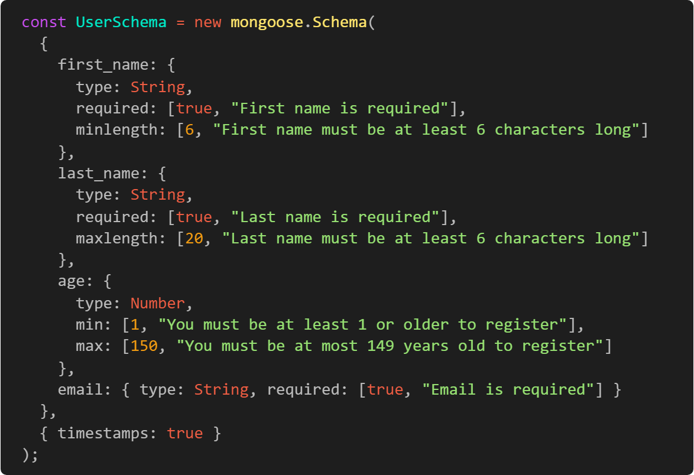

# Common Mongoose Commands & Validation

## Validation


date validation in: *.model.js
```
start: {
	type: Date,
	required: [true, ‘Start time is required’],
	min: [new Date(), “Date must be in future”]
	}
```

## Common Mongoose Commands

Here is a list and examples of some common Mongoose Commands you may need to use. These will be used in most Mongoose projects so make sure to practice them as much as you can.

### Defining a User Schema

```
// Create a Schema for Users
const UserSchema = new mongoose.Schema({
 name: { type: String },
 age: { type: Number }
}, { timestamps: true })
// create a constructor function for our model and store in variable 'User'
const User = mongoose.model('User', UserSchema);
```

### Finding all Users

```
// ...retrieve an array of all documents in the User collection
User.find()
    .then(users => {
        // logic with users results
    })
    .catch(err => res.json(err));
```

### Finding all Users where their name is Jessica

```
// ...retrieve an array of documents matching the query object criteria
User.find({name:'Jessica'})
    .then(usersNamedJessica => {
        // logic with usersNamedJessica results
    })
    .catch(err => res.json(err));
```

### Finding one User by \_id

```
// ...retrieve 1 document (the first record found) matching the query object criteria
User.findOne({_id: '5d34d361db64c9267ed91f73'})
    .then(user => {
        // logic with single user object result
    })
    .catch(err => res.json(err));
```

### Create a user

```
 // ...create a new document to store in the User collection and save it to the DB.
const bob = new User(req.body);
// req.body is an object containing all the users data.
// if we look at req.body as an object literal it would look like this
	/*
     * req.body = {
     *		"name": "Bob Ross",
     *		"age": 42
     *	}
    **/
bob.save()
    .then(newUser => {
        // logic with succesfully saved newUser object
    })
    .catch(err => res.json(err));
 // If there's an error and the record was not saved, this (err) will contain validation errors.
```

### Create a user (simplified)

```
// ...create a new document to store in the User collection and save it to the DB.
const { userData } = req.body;
User.create(userData)
   .then(newUser => {
       // logic with succesfully saved newUser object
   })
   .catch(err => res.json(err));
// If there's an error and the record was not saved, this (err) will contain validation errors.
```

### Delete all users

```
// ...delete all documents of the User collection
User.remove()
    .then(deletedUsers => {
        // logic (if any) with successfully removed deletedUsers object
    })
    .catch(err => res.json(err));
```

### Delete one user

```
// ...delete 1 document that matches the query object criteria
User.remove({_id: '5d34d361db64c9267ed91f73'})
    .then(deletedUser => {
        // logic (if any) with successfully removed deletedUser object
    })
    .catch(err => res.json(err));
```

### Update one record

```
// ...update 1 document that matches the query object criteria
User.updateOne({name:'Bob Ross'}, {
    name: 'Ross Bob',
    $push: {pets: {name: 'Sprinkles', type: 'Chubby Unicorn' }}
})
    .then(result => {
        // logic with result -- note this will be the original object by default!
    })
    .catch(err => res.json(err));
```

### Advanced Queries. An alternative way to update a record

```
User.findOne({name: 'Bob Ross'})
    .then(user => {
        user.name = 'Rob Boss';
        user.pets.push({name: 'Sprinkles', type: 'Chubby Unicorn'});
        return user.save();
    })
    .then(saveResult => res.json(saveResult))
    .catch(err => res.json(err));
```

### Validate for uniqueness before creating new DB entry

```
User.exists({name: req.body.name})
    .then(userExists => {
        if (userExists) {
            // Promise.reject() will activate the .catch() below.
            return Promise.reject('Error Message Goes Here');
        }
        return User.create(req.body);
    })
    .then(saveResult => res.json(saveResult))
    .catch(err => res.json(err));
```
